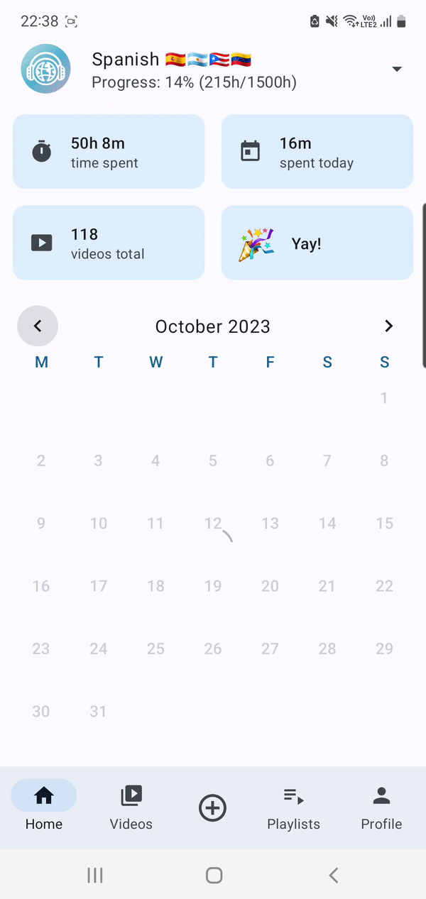
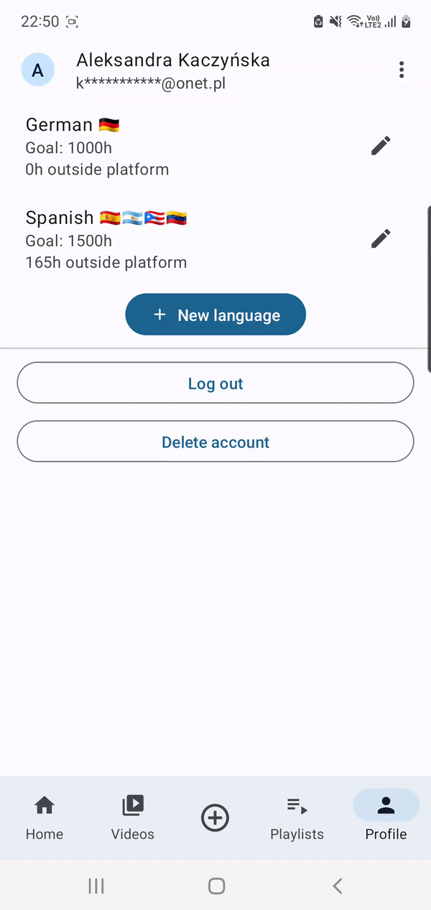

# LingLog - Language Learning Video Tracker

## Table of Contents
- [Overview](#overview)
- [Libraries Used](#libraries-used)
- [Features](#features)
- [Installation Requirements](#installation-requirements)

## Overview

Language learning is a journey that demands dedication, immersion, and consistent effort. The importance of input, such as watching videos in the target language, cannot be understated in the pursuit of mastering a new language. LingLog stands as a dedicated companion for language enthusiasts, aiming to enhance and streamline the learning experience.

Tracking your language learning progress is crucial for understanding your development and staying motivated. LingLog offers a comprehensive solution for learners to meticulously monitor their learning journey by keeping track of the time spent watching educational videos in their chosen language.

By empowering users to manually input videos or integrate their liked videos and playlists from YouTube, LingLog simplifies the process of cataloging and managing learning resources. Whether it's noting daily progress, accumulating total study time, or organizing multiple language courses, LingLog is designed to facilitate efficient language learning management.

The app's dynamic theming, powered by Material 3, ensures a visually appealing and intuitive interface. LingLog is designed to enhance the language learning experience by providing an organized and user-friendly tool. It emphasizes the importance of maintaining consistent input and tracking progress, offering a reliable means to manage your language learning journey effectively.

## Libraries Used

The LingLog app is written entirely in Kotlin, utilizing the following libraries: 

1. **Firebase Authentication Library:** Authentication tool provided by Firebase for user authentication.
2. **Cloud Firestore Library:** Firestore as a cloud-hosted, NoSQL database for storing app data.
3. **Hilt:** Dependency injection framework for Android.
4. **Paging3:** Pagination library to load data gradually and gracefully within the app.
5. **Retrofit:** HTTP client for making network requests.
6. **Coil:** Image loading library for handling image assets efficiently.
7. **DataStore:** Android's modern data storage solution for storing key-value pairs or typed objects.
8. **Material 3:** Utilized for UI components and dynamic theming.


## Features

LingLog is structured around multiple screens, each offering distinct functionalities tailored to enhance the language learning experience. The app's interface is designed to integrate various features across different screens, providing users with intuitive access to diverse functionalities.

1. **Home Screen**
- **Time Summation:** Calculates and displays total time spent, daily time, and total number of watched videos.
- **Calendar:** Presents a calendar view with daily minutes of watched videos.

<table style="border-collapse: collapse;">
  <tr>
    <td style="padding: 8px;"></td>
    <td style="padding: 8px;"></td>
  </tr>
</table>


3. **Videos Screen**
- **Video Tracking:** Track videos in the target language.
- **Watching History:** View videos grouped by date.

<table style="border-collapse: collapse;">
  <tr>
    <td style="padding: 8px;"></td>
    <td style="padding: 8px;"></td>
  </tr>
</table>

4. **Video Edit Screen**
- **URL Video Addition:** Add and edit videos manually via URL.
- **Error Feedback:** Notify user about errors loading data.

<table style="border-collapse: collapse;">
  <tr>
    <td style="padding: 8px;"></td>
    <td style="padding: 8px;"></td>
  </tr>
</table>

5. **Playlists Screen**
- **YouTube Integration:** Log in using the YouTube Data API to display liked videos and playlists for easy addition to LingLog.

<table style="border-collapse: collapse;">
  <tr>
    <td style="padding: 8px;"></td>
    <td style="padding: 8px;"></td>
  </tr>
</table>

6. **Profile Screen**
- **Multiple Language Courses:** Add and switch between multiple language courses.
- **Edit Languages:** Added languages can be edited.
- **Manage Your Account:** Log out or delete account, change display name. 

<table style="border-collapse: collapse;">
  <tr>
    <td style="padding: 8px;"></td>
    <td style="padding: 8px;"></td>
  </tr>
</table>

## Installation Requirements

Please note that this repository contains the source code for the LingLog app. To successfully install and run the app, you will need to perform additional setup steps outside of this codebase.

### Firebase Project Configuration
LingLog utilizes Firebase services for authentication and data storage. To set up the Firebase project for this app:

1. Create a Firebase project at [Firebase Console](https://console.firebase.google.com/).
2. Follow Firebase documentation to add your Android app to the Firebase project and download the `google-services.json` configuration file.
3. Place the `google-services.json` file in the `app/` directory of this project.

### YouTube API Configuration
The app integrates with the YouTube Data API to fetch liked videos and playlists. To configure the YouTube API:

1. Go to [Google Cloud Console](https://console.cloud.google.com/).
2. Create a new project or use an existing one.
3. Enable the YouTube Data API v3 for your project.
4. Generate an API key and restrict it to be used only by this app.
5. Add the API key and Client ID.
6. Configure OAuth consent screen.

#### Adding API Keys to `gradle.properties`

After obtaining the necessary API key for the YouTube Data API from the Google Cloud Console, it's essential to add it to your `gradle.properties` file in the project. Here are the steps:

1. Open the `gradle.properties` file in your project.
2. Add the following lines at the end of the file:

    ```properties
    API_KEY="Your_Youtube_API_Key_Here"
    CLIENT_ID="Your_Client_ID_Here"
    ```

    Replace `"Your_Youtube_API_Key_Here"` with your actual YouTube API key and `"Your_Client_ID_Here"` with your client ID obtained from Google Cloud Console.

3. Save the `gradle.properties` file.

Please ensure you complete these configurations to enable the full functionality of the LingLog app.

#### Creating OAuth Consent Screen

In addition to configuring the YouTube API, creating an OAuth consent screen is necessary to enable authentication and permissions for the LingLog app to access YouTube data. Follow these steps:

1. Go to the [Google Cloud Console](https://console.cloud.google.com/).
2. Navigate to the "APIs & Services" > "Credentials" section.
3. Under "OAuth consent screen," configure the necessary details such as app name, user support email, etc.
4. Add required scopes and details regarding how the app will use the YouTube data (you can find them in `AuthConstants` class).
5. Save the OAuth consent screen information.
